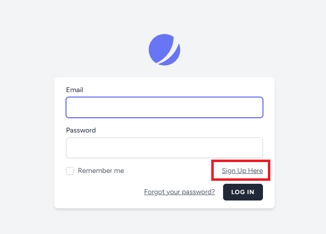
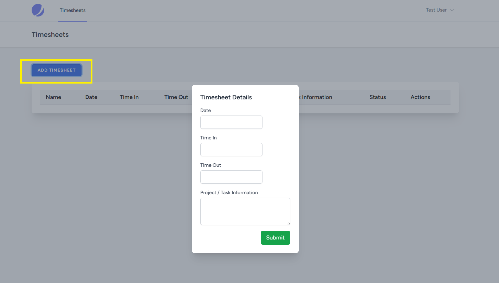
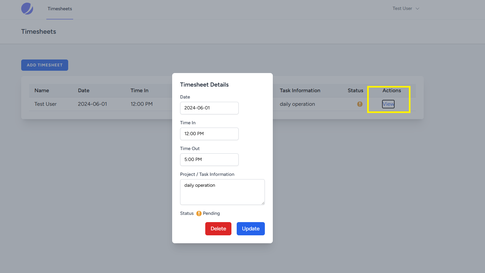
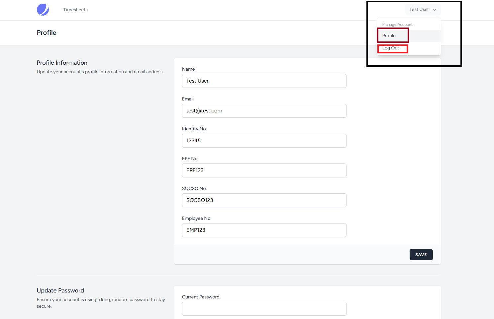
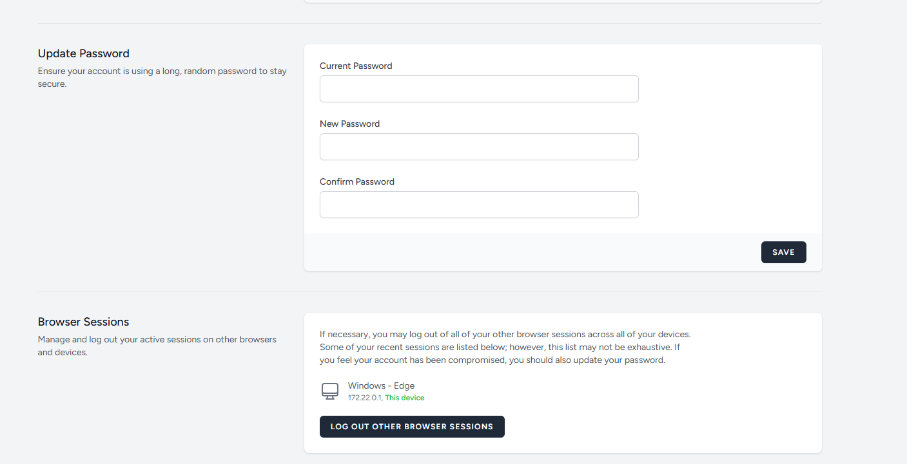
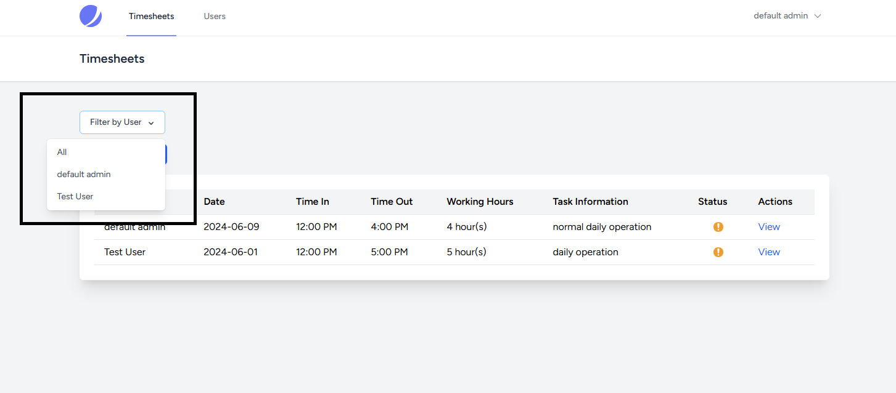
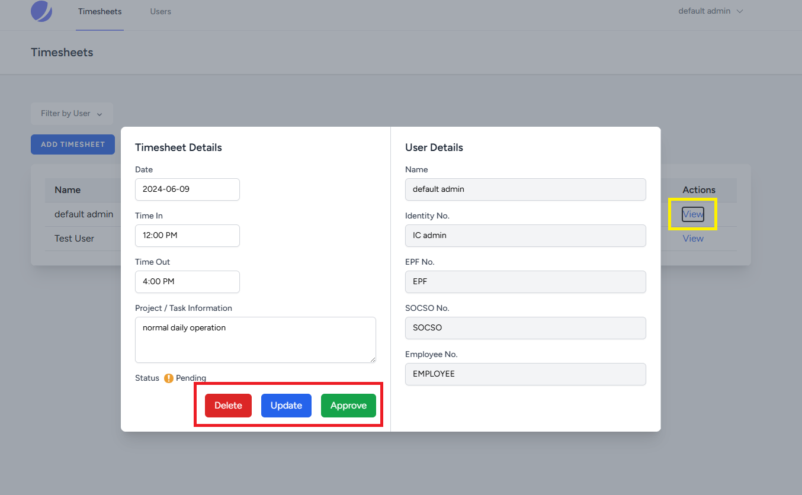
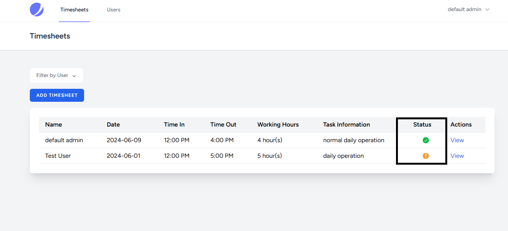
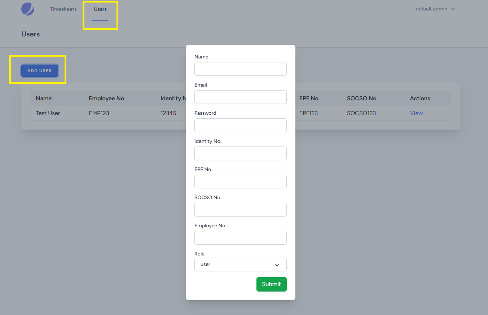
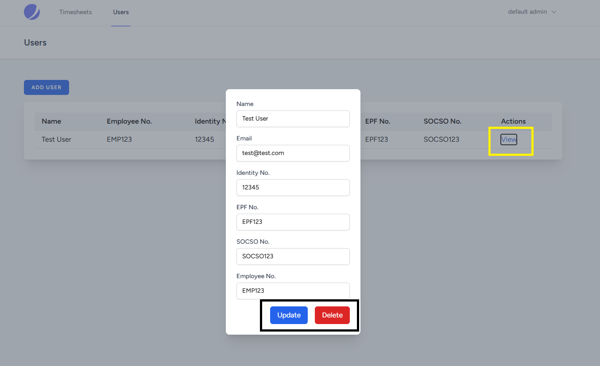

## Payroll Timesheet Submission

## Tool used

-   Laravel 11
-   Laravel Jetstream with Livewire
-   MySQL
-   JQuery
-   Docker

## Installation

You may download or git pull the codebase, then follow the instructions below to run the system.

-   Go to the project directory
-   Edit `db_password.txt` and `db_database.txt` inside the secrets folder to set the default root password and database.
-   Update the NGINX configuration in `default.conf` inside the **nginx** folder if needed.
-   After editing the config files, execute the following commands:

```bash
  docker compose build

  docker compose run -d
```

-   These commands will build and run the containers, setting up all necessary files to run the program.
-   Wait for the MySQL container to set up, then execute the following commands in the project directory:

```bash
  docker exec app php artisan key:generate

  docker exec app php artisan migrate

  docker exec app php artisan db:seed
```

-   These commands will generate a key, set up the database, and insert a default admin account with the following credentials:

```bash
  admin@admin.com
  password
```

## Usage Guideline

### Login and Registration Sign-up




You will be redirected to the login screen if you are unauthenticated. You can sign up to register as a new user, creating a **normal user account**.

### Timesheet Submission



After logging in, you will see the Timesheet screen. Users can submit their timesheets by clicking the Add Timesheet button. Newly submitted timesheets will be in **Pending** status until approved by an admin.



Users can update their submitted timesheets if they made a mistake by clicking the **view** button. Updated timesheets will revert to **Pending** status for admin review and approval.

### Profile Update




Users can update their profile information, change their password, and log out from other browsers using the dropdown options.

### Admin Timesheet



Admin users can _filter timesheet records by user_ and submit their own timesheets like normal users.

### Timesheet Approval




Admins can update, delete, and approve any timesheet by clicking the **view** button. Approved timesheets will display as **Approved** with a checkmark icon.

### User Management



Admin users can view the User list from the navigation menu and create new user or admin accounts by clicking the **Add User** button.



Admins can also update and delete user accounts.

# Codebase Structure

## Highlight Root Directories

-   `Dockerfile` - Docker configuration file.
-   `docker-compose.yml` - Docker Compose configuration.
-   `docker-entrypoint.sh` - Docker entry point script.
-   `phpunit.xml` - PHPUnit configuration.
-   `tailwind.config.js` - Tailwind CSS configuration.
-   `app/` - Application core code.

| Directory/File     | Description                                            |
| ------------------ | ------------------------------------------------------ |
| `app/Console`      | Contains artisan commands and custom console commands. |
| `app/Exceptions`   | Handles the application's exception handling.          |
| `app/Http`         |                                                        |
| ├── `Controllers/` | Contains the controllers for the application.          |
| ├── `Middleware/`  | Contains the middleware for the application.           |
| └── `Kernel.php`   | HTTP kernel configuration.                             |
| `app/Models`       | Contains the Eloquent models.                          |
| `app/Policies`     | Contains the authorization policies.                   |
| `app/Providers`    | Contains the service providers for the application.    |
| `app/Services`     | Contains custom service classes.                       |
| `app/Traits`       | Contains reusable traits for the application.          |

-   `config/` - Configuration files.
-   `database/` - Database migrations and seeders.
-   `nginx/` - Nginx configuration files.
-   `public/` - Publicly accessible files.
-   `resources/` - View files and raw assets.

| Directory/File    | Description                               |
| ----------------- | ----------------------------------------- |
| `resources/css`   | Contains CSS files.                       |
| `resources/js`    | Contains JavaScript files.                |
| `resources/lang`  | Contains language files for localization. |
| `resources/views` | Contains Blade template files for views.  |

-   `routes/` - Application routes.
-   `secrets/` - Docker Secret files.
-   `tests/` - Automated test files.

| Directory/File       | Description                         |
| -------------------- | ----------------------------------- |
| `tests/Feature`      | Contains feature tests.             |
| `tests/Unit`         | Contains unit tests.                |
| `tests/TestCase.php` | Base test case class for all tests. |

# Development Guideline

## Identify functions

Based on requirements, identify all features that need to be implemented:

-   User Authentication
    -   Register
    -   Update profile
    -   Change password
    -   Login
    -   Logout
-   Timesheet Submissions
    -   View Timesheet
    -   Add Timesheet
    -   Update Timesheet
    -   Delete Timesheet
-   Role-based Access Control
    -   Normal User
        -   All functions above
    -   Admin User
        -   All functions above
        -   Create User
        -   Update User
        -   Delete User
        -   Approve Timesheet

## Security Concern

Security measures to ensure data protection:

-   Prevent SQL Injection
-   Prevent XSS
-   Password Hashing
-   Session authentication

## Containerisation

Portable and easy deployment using Docker. Docker-compose will manage multiple containers.

## Deciding the Tools and Tech Stack

Current in-used tech stacks:

-   Laravel 11
-   Laravel Jetstream with Livewire \*
-   MySQL
-   JQuery

You may need to assess or research the tools are compatible with current stack.

\*_Due to the nature of this assessment test, many Jetstream features and settings are disabled. The main purpose of Jetstream here is its UI layout._

## Version Control

-   Branching Model: Follow Git Flow.
    -   `main`: Production-ready code.
    -   `develop`: Latest development changes.
    -   `feature/xyz`: Feature-specific branches.
    -   `bugfix/xyz`: Bug fix-specific branches.
-   Commit Messages: Follow Conventional Commits. Structure: <type>(<scope>): <description>.
    -   Example: - add login functionality
-   Pull Requests: Create a pull request before merging. A code review by the repository owner is required.

## Coding style

-   Follow DRY (Do not repeat yourself) and KISS (Keep it simple and stupid) principles.
-   Adhere to SOLID principles.
-   Comment every function.

## Controller and Service class

**Controller**:

-   Controllers are classified as API or View controllers.
-   API controllers return JSON responses.
-   View controllers return view responses.
-   Controllers execute events via Service class functions.

Controller class sample:

```bash
class TimesheetController extends Controller
{
    /**
     * Show the form for creating a new timesheet.
     */
    public function create()
    {
        return view('components.timesheet.timesheet-view', ['object' => 'timesheet', 'mode' => 'create']);
    }

    ...
}

```

**Service**:

-   Each service class performs one action.
-   Service classes validate input based on requirements.
-   Service class execution may return Validator results if validation errors exist.

Service class sample:

```bash
class CreateTimesheet extends BaseService
{

    /**
     * validation rules.
     *
     * @return array
     */
    public function rules()
    {
        return [
            'date' => 'required|date|date_format:Y-m-d',
            'time_in' => 'required|date_format:H:i:s',
            ...
        ];
    }

    /**
     * Create a Timesheet.
     *
     * @param array $data
     * @return mixed
     */
    public function execute(array $data)
    {
        try {
            $validated_result = $this->validate($data);
            if ($validated_result !== true) return $validated_result;

            $timesheet = Timesheet::create([
                'date' => $data['date'],
                'time_in' => $data['time_in'],
                ...
            ]);

            return $timesheet;
        } catch (Exception $ex) {
            $this->log('error', $ex->getMessage() . PHP_EOL . PHP_EOL . $ex->getTraceAsString());
            return false;
        }
    }
}

```

## Policy

Implement policies to ensure authenticated users are authorized for actionss.

Policy class implementation:

```bash
class TimesheetPolicy
{

    /**
     * Determine whether the user can view the model.
     */
    public function edit(User $user, Timesheet $timesheet): bool
    {
        return $user->hasRole('admin') || ($user->id == $timesheet->user->id);
    }

    ...
}

```

Register policy class in `AuthServiceProvider.php`.

```bash
    protected $policies = [
        Timesheet::class => TimesheetPolicy::class,
    ];
```

Call authorize() in the controller. It will return a 403 error code if not allowed to proceed.

```bash
    /**
     * Show the form for editing the timesheet.
     */
    public function edit(Request $request, Timesheet $timesheet)
    {
        $this->authorize('edit', $timesheet);
        return view('components.timesheet.timesheet-view', ['object' => 'timesheet', 'mode' => 'edit', 'timesheet' => $timesheet]);
    }
```

## Model

All model classes are required to implement Soft Delete.

```bash
use Illuminate\Database\Eloquent\SoftDeletes;

class Timesheet extends Model
{
    use SoftDeletes;

    ...

```

## Testing

-   Unit tests are required for all service classes. See the example below.

```bash
use Tests\TestCase;

class CreateUserTest extends TestCase
{
    use DatabaseTransactions;

    /**
     * Create User test.
     */
    public function test_create_user(): void
    {
        $data = [
            'name' => 'Test User',
            'email' => 'TestUser@test.com',
            'password' => 'password',
            'ic' => 'IC123',
            'epf_no' => 'EPF123',
            'socso_no' => 'SOCSO123',
            'employee_no' => 'EMPLOYEE123',
            'role' => 'user'
        ];
        $response = app(CreateUser::class)->execute($data);
        $this->assertInstanceOf(User::class, $response);
        $this->assertDatabaseHas('users', ['id' => $response->id]);
    }
}

```

-   Feature tests are required to check user behavior or event actions. See the example below.

```bash
use Tests\TestCase;

class UserTest extends TestCase
{
    public function test_admin_can_view_user_list(): void
    {
        $user = User::factory()->create();
        $user->assignRole('admin');
        $this->actingAs($user);

        $response = $this->get('/user');

        $response->assertStatus(200);
    }

    public function test_user_cant_view_user_list(): void
    {
        $user = User::factory()->create();
        $user->assignRole('user');
        $this->actingAs($user);

        $response = $this->get('/user');

        $response->assertStatus(401);
    }

    public function test_admin_can_add_user(): void
    {
        $user = User::factory()->create();
        $user->assignRole('admin');
        $this->actingAs($user);

        $response = $this->post('/user/store', [
            'name' => 'Test User Name',
            'email' => 'test@test.com',
            'password' => 'password',
            'ic' => '12345',
            'epf_no' => 'EPFNO',
            'socso_no' => 'SOCSONO',
            'employee_no' => 'EMPLOYEENO',
            'role' => 'user'
        ]);

        $response->assertStatus(200);
        $this->assertEquals(true, json_decode($response->getContent(), true)['success']);
        $this->assertDatabaseHas('users', ['id' => json_decode($response->getContent(), true)['result']['id']]);
    }

    ...
}
```
