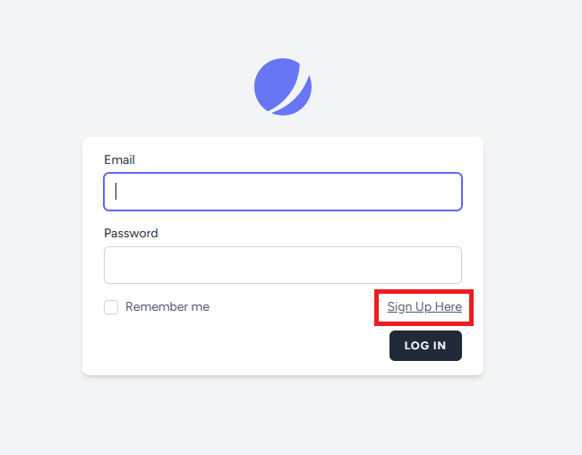

## Payroll Timesheet Submission

## Tool used

-   Laravel 11
-   Laravel Jetstream with Livewire
-   MySQL
-   JQuery
-   Docker

## Installation

You may choose to download or git pull the code base, then follow the installation instructions below to run the system.

-   Go to the project directory
-   You may want to edit `db_password.txt` and `db_database.txt` inside **secrets** folder, these 2 files will generate default root password and database.
-   You may also need to change NGINX configuration in `default.conf` at **nginx folder**
-   After done edit config files, do execute the commands below:

```bash
  docker compose build

  docker compose run -d
```

-   The commands above will build and run containers as well as setup all the basics file in order to run the program.
-   You may want to wait for MySQL container setup for a while, then proceed the commands below at same project directory:

```bash
  docker exec app php artisan key:generate

  docker exec app php artisan migrate

  docker exec app php artisan db:seed
```

-   These commands will generate key, setup database and insert an default admin account. Default admin account login are as below:

```bash
  admin@admin.com
  password
```

## Usage Guideline

### Login and Registration Sign-up




You will be redirected to login screen if you are unauthenticated. You may sign-up from the button to register as new user, the registration here will create **normal user account**.

### Timesheet Submission


After logged in, you will come to Timesheet screen, user can submit their timesheet by clicking the Add Timesheet button. Newly submitted timesheet will be in **Pending** status until admin approved the submission.


User can update their submitted timesheet in case they submit wrong details by clicking **view** button. Updated timesheet will changed status back to **Pending** for admin to review and approve again.

### Profile Update


User can update their profile information by clicking the option from the dropdown as well as change password and logged out from other browser.

### Admin Timesheet


Admin user can _filter timesheet record by user_ as well as submit their own timesheet like normal user do.

### Timesheet Approval


Admin can update and delete any timesheet as well as approve the submission by clicking the **view** button. After approved, the status will display as **Approved** together with checkmark icon.

### User Management


Admin user can view User list from navigation menu above and create new user or admin account by clicking **Add User** button.


Admin also can update and delete any user accounts.

# Codebase Structure

## Highlight Root Directories

-   `Dockerfile` - Docker configuration file.
-   `docker-compose.yml` - Docker Compose configuration.
-   `docker-entrypoint.sh` - Docker entry point script.
-   `phpunit.xml` - PHPUnit configuration.
-   `tailwind.config.js` - Tailwind CSS configuration.
-   `app/` - Application core code.

| Directory/File     | Description                                            |
| ------------------ | ------------------------------------------------------ |
| `app/Console`      | Contains artisan commands and custom console commands. |
| `app/Exceptions`   | Handles the application's exception handling.          |
| `app/Http`         |                                                        |
| ├── `Controllers/` | Contains the controllers for the application.          |
| ├── `Middleware/`  | Contains the middleware for the application.           |
| └── `Kernel.php`   | HTTP kernel configuration.                             |
| `app/Models`       | Contains the Eloquent models.                          |
| `app/Policies`     | Contains the authorization policies.                   |
| `app/Providers`    | Contains the service providers for the application.    |
| `app/Services`     | Contains custom service classes.                       |
| `app/Traits`       | Contains reusable traits for the application.          |

-   `config/` - Configuration files.
-   `database/` - Database migrations and seeders.
-   `nginx/` - Nginx configuration files.
-   `public/` - Publicly accessible files.
-   `resources/` - View files and raw assets.

| Directory/File    | Description                               |
| ----------------- | ----------------------------------------- |
| `resources/css`   | Contains CSS files.                       |
| `resources/js`    | Contains JavaScript files.                |
| `resources/lang`  | Contains language files for localization. |
| `resources/views` | Contains Blade template files for views.  |

-   `routes/` - Application routes.
-   `secrets/` - Docker Secret files.
-   `tests/` - Automated test files.

| Directory/File       | Description                         |
| -------------------- | ----------------------------------- |
| `tests/Feature`      | Contains feature tests.             |
| `tests/Unit`         | Contains unit tests.                |
| `tests/TestCase.php` | Base test case class for all tests. |

# Development Guideline

## Identify functions

Based on requirements, identify all features that required to implement:

-   User Authentication
    -   Register
    -   Update profile
    -   Change password
    -   Login
    -   Logout
-   Timesheet Submissions
    -   View Timesheet
    -   Add Timesheet
    -   Update Timesheet
    -   Delete Timesheet
-   Role-based Access Control
    -   Normal User
        -   All functions above
    -   Admin User
        -   All functions above
        -   Create User
        -   Update User
        -   Delete User
        -   Approve Timesheet

## Security Concern

Security must be concerned to ensure any details are not leaked or being accessed easily.

-   Prevent SQL Injection
-   Prevent XSS
-   Password Hashing
-   Session authentication

## Containerisation

Portable and easy deployment by using Docker, Docker-compose also will be used to manage multiple containers.

## Deciding the Tools and Tech Stack

Current in-used tech stacks:

-   Laravel 11
-   Laravel Jetstream with Livewire \*
-   MySQL
-   JQuery

You may need to assess or research the tools are compatible with current stack.

\*_due to it is an assessment test, so I disabled a lot but not all of Jetstream features and settings and develop with original way of Laravel framework. Main purpose of Jetstream is their UI layout._

## Coding style

-   All code must follow practices of DRY (Do not repeat yourself) and KISS (Keep it simple and stupid).
-   Try your best to follow SOLID principles.
-   Leave comment on every function.

## Controller and Service class

**Controller**:

-   Controller class will clasified as API or View controller.
-   API controller will return JSON response.
-   View controller will return view response.
-   Controller will execute event call with Service class function.

Controller class sample:

```bash
class TimesheetController extends Controller
{
    /**
     * Show the form for creating a new timesheet.
     */
    public function create()
    {
        return view('components.timesheet.timesheet-view', ['object' => 'timesheet', 'mode' => 'create']);
    }

    ...
}

```

**Service**:

-   Each service class only execute 1 action.
-   Every service class may need to validate input with rules, depend on requirement.
-   Executing service class may return `Validator` result if there are validation errors exists.

Service class sample:

```bash
class CreateTimesheet extends BaseService
{

    /**
     * validation rules.
     *
     * @return array
     */
    public function rules()
    {
        return [
            'date' => 'required|date|date_format:Y-m-d',
            'time_in' => 'required|date_format:H:i:s',
            ...
        ];
    }

    /**
     * Create a Timesheet.
     *
     * @param array $data
     * @return mixed
     */
    public function execute(array $data)
    {
        try {
            $validated_result = $this->validate($data);
            if ($validated_result !== true) return $validated_result;

            $timesheet = Timesheet::create([
                'date' => $data['date'],
                'time_in' => $data['time_in'],
                ...
            ]);

            return $timesheet;
        } catch (Exception $ex) {
            $this->log('error', $ex->getMessage() . PHP_EOL . PHP_EOL . $ex->getTraceAsString());
            return false;
        }
    }
}

```

## Policy

Policy is recommended to implement to check authenticated user is authorized for action.

Implement policy class:

-   code policy class

```bash
class TimesheetPolicy
{

    /**
     * Determine whether the user can view the model.
     */
    public function edit(User $user, Timesheet $timesheet): bool
    {
        return $user->hasRole('admin') || ($user->id == $timesheet->user->id);
    }

    ...
}

```

-   Register policy class in `AuthServiceProvider.php`

```bash
    protected $policies = [
        Timesheet::class => TimesheetPolicy::class,
    ];
```

-   call `authorize()` in controller, it will return 403 error code if not allowed to proceed.

```bash
    /**
     * Show the form for editing the timesheet.
     */
    public function edit(Request $request, Timesheet $timesheet)
    {
        $this->authorize('edit', $timesheet);
        return view('components.timesheet.timesheet-view', ['object' => 'timesheet', 'mode' => 'edit', 'timesheet' => $timesheet]);
    }
```

## Model

All model classes are required to implement Soft Delete.

```bash
use Illuminate\Database\Eloquent\SoftDeletes;

class Timesheet extends Model
{
    use SoftDeletes;

    ...

```

## Testing

-   Unit test is required for all service class, example as below.

```bash
use Tests\TestCase;

class CreateUserTest extends TestCase
{
    use DatabaseTransactions;

    /**
     * Create User test.
     */
    public function test_create_user(): void
    {
        $data = [
            'name' => 'Test User',
            'email' => 'TestUser@test.com',
            'password' => 'password',
            'ic' => 'IC123',
            'epf_no' => 'EPF123',
            'socso_no' => 'SOCSO123',
            'employee_no' => 'EMPLOYEE123',
            'role' => 'user'
        ];
        $response = app(CreateUser::class)->execute($data);
        $this->assertInstanceOf(User::class, $response);
        $this->assertDatabaseHas('users', ['id' => $response->id]);
    }
}

```

-   Feature test is required to check user behavioral or event action, example as below.

```bash
use Tests\TestCase;

class UserTest extends TestCase
{
    public function test_admin_can_view_user_list(): void
    {
        $user = User::factory()->create();
        $user->assignRole('admin');
        $this->actingAs($user);

        $response = $this->get('/user');

        $response->assertStatus(200);
    }

    public function test_user_cant_view_user_list(): void
    {
        $user = User::factory()->create();
        $user->assignRole('user');
        $this->actingAs($user);

        $response = $this->get('/user');

        $response->assertStatus(401);
    }

    public function test_admin_can_add_user(): void
    {
        $user = User::factory()->create();
        $user->assignRole('admin');
        $this->actingAs($user);

        $response = $this->post('/user/store', [
            'name' => 'Test User Name',
            'email' => 'test@test.com',
            'password' => 'password',
            'ic' => '12345',
            'epf_no' => 'EPFNO',
            'socso_no' => 'SOCSONO',
            'employee_no' => 'EMPLOYEENO',
            'role' => 'user'
        ]);

        $response->assertStatus(200);
        $this->assertEquals(true, json_decode($response->getContent(), true)['success']);
        $this->assertDatabaseHas('users', ['id' => json_decode($response->getContent(), true)['result']['id']]);
    }

    ...
}
```
